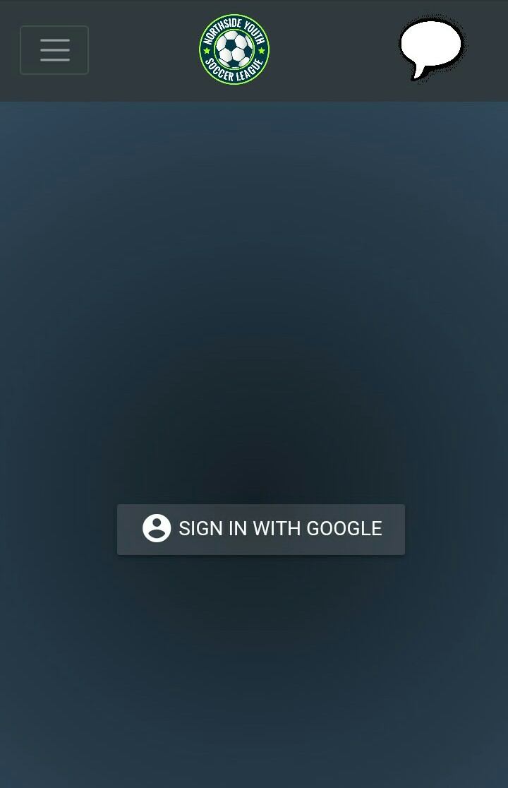

# Northside Youth Soccer League

Esto es un proyecto que hice como parte de mi educación en [MindHub](https://mindhubweb.com/), que consistió en crear una aplicación web responsive.

  

## Tecnologías usadas

- Front End:
    + HTML
    + CSS - Bootstrap
    + Javascript

- Deploy y autenticación:
    + Firebase

# Como iniciar el proyecto

 - Clonar el repositorio en su computadora
 - Ejecutar el archivo `index.html` en la carpeta `public`
 
__IMPORTANTE__: Para utilizar la autenticación y posts es necesario usar la versión deployada en firebase. Pruébala [Aquí](https://curso-mindhub.web.app/)

### Sobre la APP
Es una aplicación en la cual creo el front end de una página de futbol. En ella entre otras cosas puedo:

  - ver la fecha de los juegos próximos e información detallada como su ubicación en un mapa de google
  - registrar jugadores
  - registrarme con cuenta de google
  - una vez registrado, postear y contestar posts
  
# Vista previa

## Desktop

### Página Home

  

### Página Registration

  

### Página Game information

  

### Página Account

  

### Página Posts

  

## Mobile

### Página Home

  

### Menú Nav

  

### Página Registration

  

### Página Game information

  

### Página Account

  

### Página Posts

  

